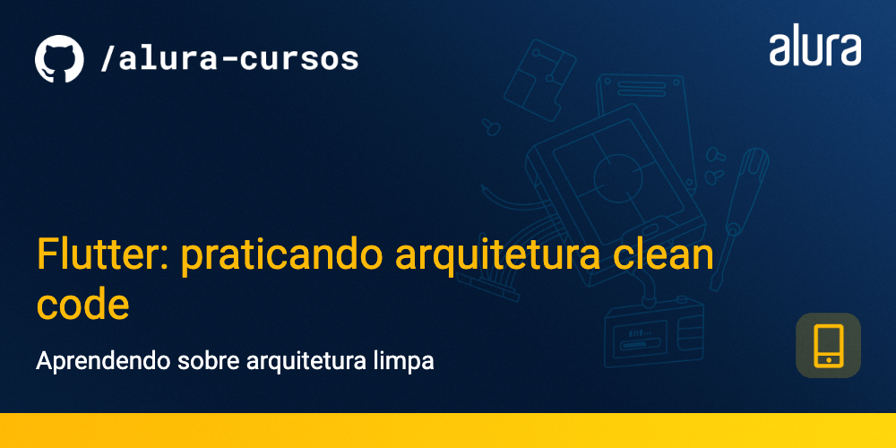

# Flutter: Praticando arquitetura Clean Code

Projeto Hyrule para o curso Flutter: Praticando arquitetura Clean Code, focado em compreender e implementar uma arquitetura limpa em seu projeto.

### Tópicos abordados no curso:

- Sobre arquitetura limpa;
- Adaptar a estrutura da arquitetura limpa para um projeto Flutter;
- As camadas que definem uma arquitetura limpa;
- Responsabilidades das camadas.
- Bibliotecas e acoplamentos;

Este curso é indicado para pessoas que já tem conhecimento intermediário e querem aprofundar seu conhecimento em Flutter, seguindo boas práticas e também entendendendo como funciona arquitetura de software dentro dos padrões mobile.

## 📑 Requisitos

- Conhecimentos intermediários de Flutter e Dart;
- VS Code com plugins do Flutter e Dart instalados (recomendado para acompanhar este curso);
- É importante ter o Flutter na versão 3.10.2.

## ✨ Funcionalidades do projeto

- Buscar entradas de uma API de acordo com uma categoria;
- Salvar uma entrada no banco de dados;
- Mostrar entradas;
- Deletar uma entrada;

## 🛠️ Abrir e rodar o projeto

Aqui vem um passo a passo para abrir e rodar o projeto.

- **Open an Existing Project** (ou alguma opção similar)
- Procure o local onde o projeto está e o selecione (Caso o projeto seja baixado via zip, é necessário extraí-lo antes de procurá-lo)
- Por fim clique em OK
- Depois basta rodar o comando `flutter run` na pasta do projeto
